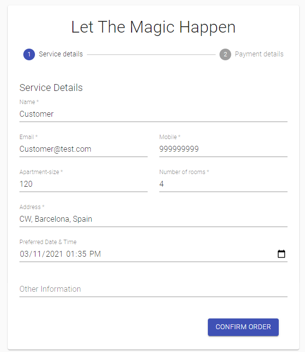
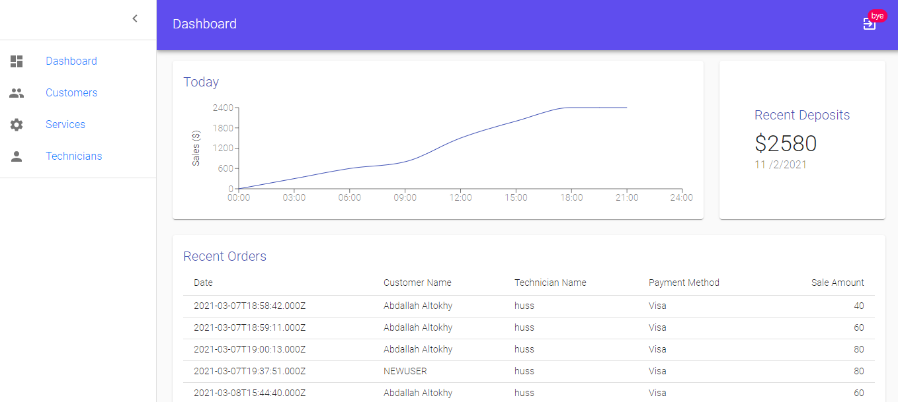

# Hogwarts

👷🏻‍♂️ Tool to connect handy technician with customers

Hogwarts is an app to connect handy technician with customers, where customers can see a list of services, book one and Pay for it all in one place. Also, the app provided an admin dashboard for the business owner, where he can keep track of all orders, customers, technician with a privileges to add, update and remove services and technicians .

## Getting started

1. clone the repo

   `git clone https://github.com/AbdallahAltokhy/Hogwarts.git`

2. From the project root file

   `cd client`

   `npm install`

   `npm start`

3. From the project root file

   `cd server`

   `npm install`

   `nodemon app.js`

4. setup a MySQL Database

5. Let The Magic Happen ✨!

## Project orientation

For the app full experience check below :

- <u>For the customer experience</u>

  - can go through the application & check the available services and book one

  - can create an account & log in "When the user is logged in, you will find all the forms pre-filled with the data provided when signing up"

  - pay for the booked services using this fake test card number "4242 4242 4242 4242"

    

- <u>For the Admin experience</u>

  - Just log in as admin using this email & password
    - Email : Admin@hogwarts.com
    - password : 123456
  - Automatically you will redirected to the admin page where you can:

    - Keep track of the business & see a list of all recent orders

    - See a list of all customers with the total orders they made

    - See a list of all services, add,update or delete one

    - See a list of all technicians, add,update or delete one as well

      

## Tech stack

### Front End:

- [React](https://reactjs.org)
- [MATERIAL-UI](https://material-ui.com/)

### Back End:

- [Node.js](https://nodejs.org/)
- [Express.js](https://expressjs.com/)
- [Sequelize ORM](https://sequelize.org)
- [MySQL](https://www.mysql.com/)

### **Authentication:**

- [JWT](https://jwt.io/)

### **Payment:**

- [Stripe](https://stripe.com/en-es)

## License

MIT © [Stefan Huckschlag](https://github.com/hucki)
